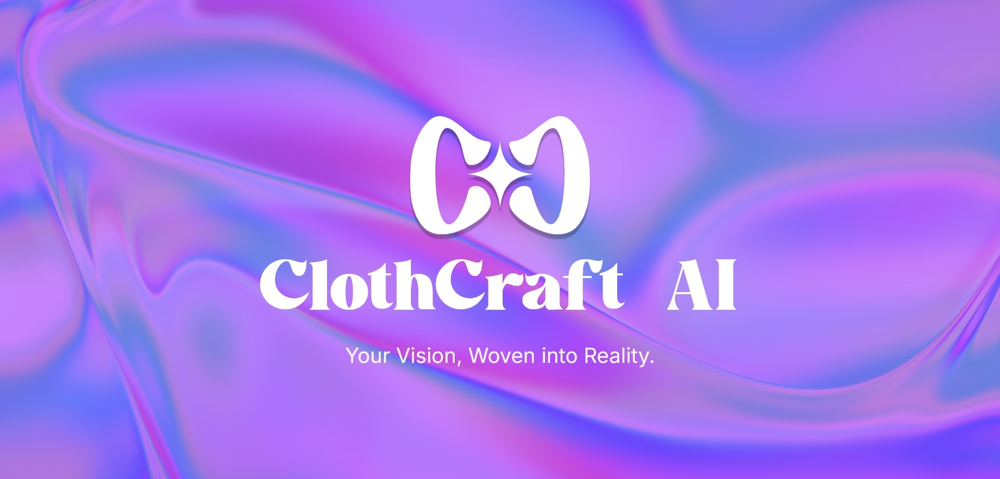
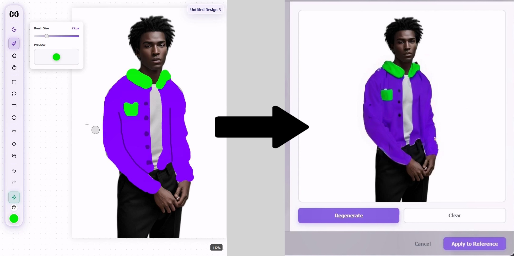
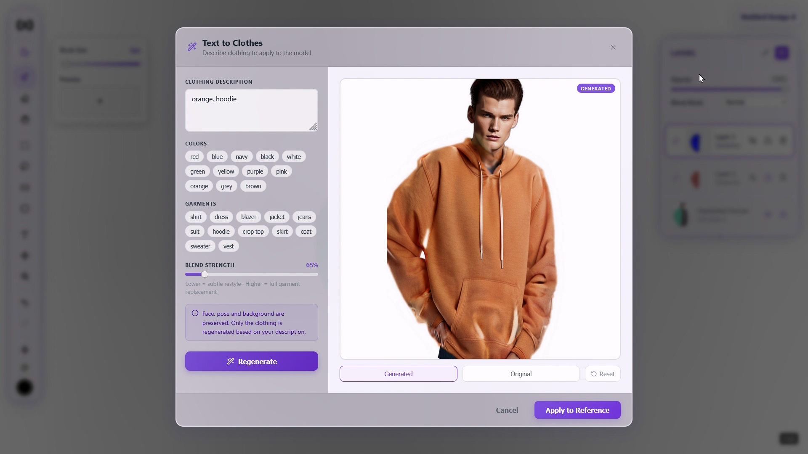
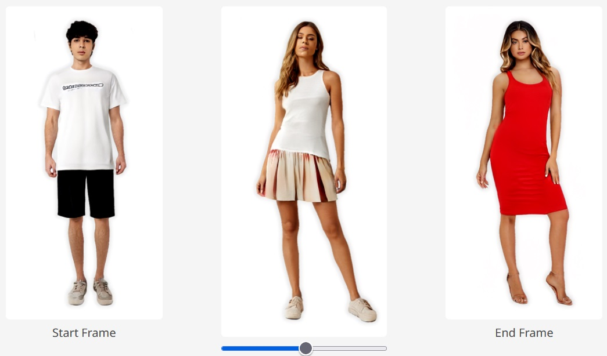
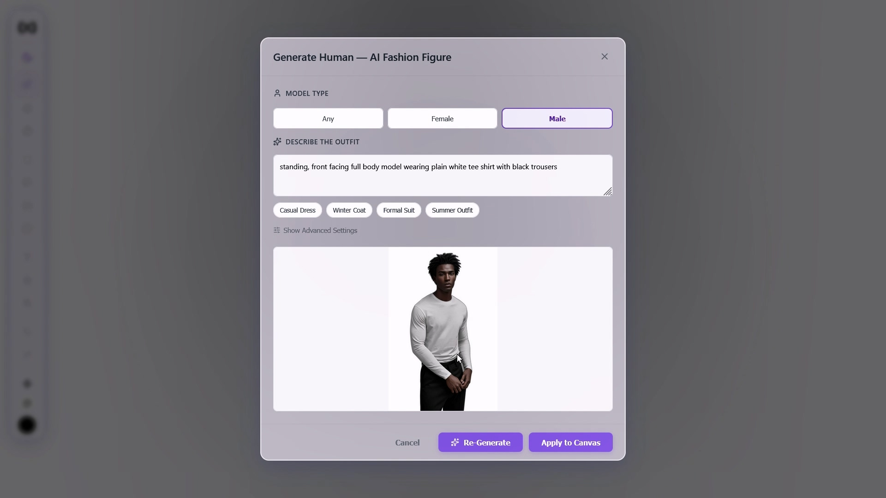

# ClothCraft AI

<div align="center">



`Pix2Pix` `Realistic Vision` `StyleGAN` `React` `FastAPI`

---

</div>

## How It Works

Draw a rough sketch on a human figure. Clothify's AI pipeline transforms it into realistic clothing in seconds.

```
  Your Doodle            Pix2Pix             Composite           Realistic Vision
 +-----------+       +-----------+       +-----------+       +-----------+
 |           |       |           |       |           |       |           |
 |  Rough    | ----> | Realistic | ----> |  Merged   | ----> |   Final   |
 |  Sketch   |       |  Texture  |       |  Output   |       |  Result   |
 |           |       |           |       |           |       |           |
 +-----------+       +-----------+       +-----------+       +-----------+
```

1. **Upload or generate** a reference human figure
2. **Sketch clothing** on a drawing layer — rough doodles are fine
3. **Hit Clothify** — Pix2Pix translates the sketch into realistic texture, composites it onto the figure, and optionally refines with Realistic Vision
4. **Export** your photorealistic result

---

## Features

| Feature | Description |
|---------|-------------|
| **Clothify Pipeline** | Doodle-to-realistic clothing via Pix2Pix + Realistic Vision |
| **Live Preview** | Real-time Pix2Pix feedback as you draw |
| **Text to Clothes** | Generate clothing from text prompts using Realistic Vision |
| **Stylebend** | Blend two outfits via StyleGAN latent-space interpolation |
| **Pattern Maker** | Generate seamless tiling patterns from sketches |
| **Moodboard** | Extract dominant colors from images into your palette |
| **Generate Human** | Create base figures from text prompts |
| **Extract Doodle** | Convert photos back to editable flat-color sketches |
| **Multi-Layer Canvas** | Full editor with brush, eraser, shapes, text, lasso, transform, undo/redo |

---

## Screenshots

Here are some of the features in action:

<table>
  <tr>
    <td align="center">
      <strong>Clothify Pipeline</strong><br/>
      <em>Turn a doodle into a realistic outfit.</em>
    </td>
    <td align="center">
      <strong>Text to Clothes</strong><br/>
      <em>Generate clothing from a text prompt.</em>
    </td>
  </tr>
  <tr>
    <td>
      
    </td>
    <td>
      
    </td>
  </tr>
  <tr>
    <td align="center">
      <strong>Stylebend</strong><br/>
      <em>Blend two outfits together.</em>
    </td>
    <td align="center">
      <strong>Model Generator</strong><br/>
      <em>Create base figures from text prompts.</em>
    </td>
  </tr>
  <tr>
    <td>
      
    </td>
    <td>
      
    </td>
  </tr>
</table>

---

## Tech Stack

| Layer | Tech |
|-------|------|
| **Frontend** | React + Vite, multi-layer canvas editor |
| **Backend** | FastAPI, async MongoDB (Motor), JWT auth (Argon2) |
| **AI Models** | Pix2Pix UNet-256, Realistic Vision v6, StyleGAN-Human, rembg (U2-Net), SegFormer |

---

## Quick Start

### Prerequisites

- Python 3.10+, Node.js 18+, MongoDB
- (Optional) NVIDIA GPU with CUDA for faster inference

### Backend

```bash
python3 -m venv .venv && source .venv/bin/activate
pip install -r requirements.txt
cp .env.example .env    # fill in your values
python app.py           # runs on http://127.0.0.1:5001
```

Place model weights in `models/`:
- `pix2pix.pth` — trained Pix2Pix UNet-256
- `realisticVisionV60B1_v51VAE.safetensors` — Realistic Vision v6
- `stylegan_human_v2_1024.pkl` — StyleGAN-Human v2

### Frontend

```bash
cd frontend
npm install
npm run dev             # runs on http://localhost:5173
```

---

## Project Structure

```
Clothify/
├── app.py                  # FastAPI backend — all routes & AI pipelines
├── networks.py             # Pix2Pix model architecture
├── models/                 # AI model weights
├── stylebend/              # StyleGAN blending microservice
└── frontend/src/
    ├── App.jsx             # Root: routing, auth, project state, AI handlers
    ├── components/
    │   ├── MultiLayerCanvas.jsx    # Core canvas editor
    │   ├── ClothifyModal.jsx       # Clothify pipeline UI
    │   ├── LayersPanel.jsx         # Layer management
    │   └── Toolbar.jsx             # Drawing tools
    ├── hooks/
    │   └── useLayerManager.js      # Layer state management
    └── services/                   # API, auth, project CRUD
```

---

## API Endpoints

### AI

| Method | Path | Description |
|--------|------|-------------|
| POST | `/translate-doodle` | Pix2Pix sketch-to-texture |
| POST | `/inpaint` | Realistic Vision img2img refinement |
| POST | `/generate-human` | Text-to-image human figure |
| POST | `/blend-styles` | StyleGAN outfit blending |
| POST | `/extract-doodle` | Photo to flat-color sketch |
| POST | `/refine-pattern` | Pattern texture refinement |

### Auth & Projects

| Method | Path | Description |
|--------|------|-------------|
| POST | `/auth/signup` | Create account |
| POST | `/auth/login` | Authenticate |
| GET | `/projects` | List user projects |
| PUT | `/projects/{id}` | Save project state |

Full API docs available at `/docs` when the backend is running.

---

<div align="center">

Built as a Final Year Project — exploring AI-assisted fashion design.

</div>
